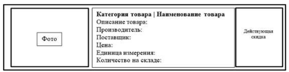
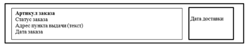

# Демонстрационный экзамен - ООО «Обувь»

## Описание предметной области

**ООО «Обувь»** - магазин по продаже обуви.

В рамках выполнения задания демонстрационного экзамена необходимо разработать основные модули информационной системы для ООО «Обувь»:

При запуске приложения окно входа – первое, что видит пользователь. На ней пользователю предлагается ввести свой логин и пароль взятой из базы данных или есть возможность перейти на экран просмотра товаров (без фильтрации, сортировки, поиска) в роли гостя.

Только после удачной авторизации пользователь получает доступ к остальным модулям системы:

- авторизованный клиент может просматривать товары (без фильтрации, сортировки, поиска);
- менеджер может просматривать товары (с фильтрацией, сортировкой, поиском), просматривать заказы;
- администратор может просматривать (с фильтрацией, сортировкой, поиском)/добавлять/редактировать/удалять товары, просматривать /добавлять/редактировать/удалять заказы.

---

## Задание на разработку приложения

> Задание состоит из четырех модулей, которые выполняются последовательно. Дополнительная информация, необходимая для реализации модулей находится в приложениях.

---

## Модуль 1. Разработка базы данных средствами СУБД

### Задание

Компания занимается продажей обуви. Очень важно постоянно получать актуальную информацию об остатках товаров на складах, поэтому необходимо реализовать следующие модули.

При запуске приложения окно входа – первое, что видит пользователь. На ней пользователю предлагается ввести свой логин и пароль, взятый из базы данных, или есть возможность перейти на экран просмотра товаров (без фильтрации, сортировки, поиска) в роли гостя.

Только после удачной авторизации пользователь получает доступ к остальным модулям системы:

- авторизованный клиент может просматривать товары (без фильтрации, сортировки, поиска);
- менеджер может просматривать товары (с фильтрацией, сортировкой, поиском), просматривать заказы;
- администратор может просматривать (с фильтрацией, сортировкой, поиском)/добавлять/редактировать/удалять товары, просматривать /добавлять/редактировать/удалять заказы.

На основе описания предметной области (Приложение 1) необходимо создать базу данных в выбранной СУБД для разрабатываемой системы. Обязательна 3 нормальная форма с обеспечением ссылочной целостности. При разработке базы данных обратите внимание на согласованную схему именования, создайте необходимые первичные и внешние ключи.

Получить ER-диаграмму средствами СУБД или ПО для построения и редактирования диаграмм (UML) и блок-схем: ER-диаграмма должна быть представлена в формате PDF и содержать таблицы, связи между ними, атрибуты и ключи (типами данных на данном этапе можно пренебречь).

Заказчик системы предоставил файлы с данными (с пометкой import в ресурсах) для переноса в новую систему (Приложение 2). Необходимо подготовить данные файлов для импорта и загрузить в разработанную базу данных.

Сохранить полученные результаты: создать скрипт БД, или файл конфигурации с данными (.dt) (для платформы 1С).

**Необходимые приложения:**
- Приложение 1
- Приложение 2

---

## Модуль 2. Разработка алгоритма и создание приложения

### Задание

Сформировать алгоритм разработки приложения: оформить алгоритм в виде блок-схемы, согласно стандарту ГОСТ 19.701-90. Документ представить в формате .pdf.

Компоненты системы должны иметь единый согласованный внешний вид, соответствующий руководству по стилю, представленному в Приложении 3. Заголовок окна (страницы) должен соответствовать назначению. Следует установить иконку приложения, если это реализуемо в рамках платформы, и логотип компании на главной форме, из ресурсов.

Оформление кода: идентификаторы должны отражать их назначение и соответствовать соглашению об именовании и стилю CamelCase (для C# и Java), snake_case (для Python) и https://its.1c.ru/db/v8std#browse:13:-1:31 (для 1C), или другой выбранной технологии разработки. Допустимо использование не более одной команды в строке.

Созданную базу данных необходимо подключить к приложению, реализующему необходимый функционал. Список товаров должен отображать информацию из базы данных.

### Авторизация

При запуске приложения окно входа – первое, что видит пользователь.

На ней пользователю предлагается ввести свой логин и пароль взятый из базы данных, или есть возможность перейти на экран просмотра товаров в роли гостя.

Только после удачной авторизации пользователь получает доступ к остальным модулям системы.

Реализуйте необходимые интерфейсы для всех пользователей системы (гость, авторизированный клиент, менеджер, администратор). После входа в любую учетную запись должна быть реализована возможность выхода на главный экран – окно входа. При переходе в любую учетную запись в интерфейсе (правый верхний угол) должны отображаться ФИО пользователя.

### Список товаров

Очень важно постоянно получать актуальную информацию об остатках товаров на складах, поэтому необходимо реализовать вывод товаров, которые хранятся в базе данных: фото товара (при отсутствии изображения необходимо вывести картинку-заглушку из ресурсов (picture.png) (Приложение 2)), наименование товара, категория товара, описание товара, производитель, поставщик, цена, единица измерения, количество на складе, действующая скидка по следующему образцу, в учетных записях (гость, авторизированный клиент, менеджер, администратор):

Необходимо подсвечивать строки с данными о конкретном товаре в зависимости от размера действующей скидки. В случае если размер скидки превышает 15%, в качестве фона необходимо применить цвет #2E8B57. Если у товара снижена цена, то основная цена должна быть перечеркнута, цвет шрифта красный и рядом с ней указана итоговая цена, цвет шрифта черный. Если товара нет на складе, строка выделяется голубым цветом.

Выполнить отладку модуля для проверки функциональности: приложение должно корректно работать и не должно происходить аварийного завершения работы. Создайте документ docx и вложите туда скриншоты корректной работы системы.

**Необходимые приложения:**
- Приложение 3

---

## Модуль 3. Разработка последовательного пользовательского интерфейса. Создание формы добавления / редактирования товаров. Создание кнопки удаления товаров.

### Задание

Реализовать последовательный пользовательский интерфейс, позволяющий перемещаться между существующими окнами (страницами) в приложении (в том числе обратно, например, с помощью кнопки «Назад»). Обеспечить соответствующий заголовок на каждом окне (странице) приложения.

Реализовать обработку исключительных ситуаций в приложении. Необходимо уведомлять пользователя о совершаемых им ошибках или о запрещенных в рамках задания действиях, предупреждать о неотвратимых операциях. Окна сообщений соответствующих типов (например, ошибка, предупреждение, информация) должны отображаться с соответствующим заголовком и пиктограммой. Текст сообщения должен быть полезным и информативным, содержать полную информацию о совершенных ошибках пользователя и порядок действий для их исправления. Также можно использовать визуальные подсказки для пользователя при вводе данных.

Необходимо использовать комментарии для пояснения неочевидных фрагментов кода. Комментарии должны присутствовать только в местах, которые требуют дополнительного пояснения.

Необходимо реализовать возможность сортировки, фильтрации, поиска, расположите элементы по своему усмотрению.

### Поиск

Менеджер и администратор должны иметь возможность искать товары, используя поисковую строку. Поиск должен осуществляться по всем доступным данным с текстовым типом данных, в том числе по нескольким атрибутам одновременно.

### Сортировка

Менеджер и администратор должны иметь возможность отсортировать товары (по возрастанию и убыванию) по количеству на складе.

### Фильтрация

Кроме этого, менеджер и администратор должны иметь возможность отфильтровать данные по поставщику. Первым элементом в выпадающем списке должен быть "Все поставщики", при выборе которого настройки фильтра сбрасываются.

Поиск, сортировка и фильтрация должны происходить в реальном времени, без необходимости нажатия кнопки "найти"/ "отфильтровать" и т.п. Фильтрация и поиск должны применяться совместно. Параметры сортировки, выбранные ранее пользователем, должны сохраняться и во время фильтрации с поиском.

### Добавление и редактирование товаров

Необходимо реализовать возможность добавления и редактирования исходных товаров. Добавлять и редактировать данные может только администратор.

Необходимо добавить возможность редактирования данных существующего товара, а также добавление нового товара в новом окне - форме для добавления/ редактирования товара. Переходы на данное окно должны быть реализованы из формы списка: для редактирования - при нажатии на конкретный элемент, для добавления - при нажатии кнопки "Добавить товар".

На форме должны быть предусмотрены следующие поля: фото товара (при отсутствии изображения необходимо вывести картинку-заглушку из ресурсов (picture.png) Прил_2_ОЗ_КОД 09.02.07-2-2026-М1.rar), наименование товара, категория товара (выпадающий список), описание товара, производитель (выпадающий список), поставщик, цена, единица измерения, количество на складе, действующая скидка. Стоимость товара может включать сотые части, а также не может быть отрицательной. Минимальное количество также не может принимать отрицательные значения.

При открытии формы для редактирования все поля выбранного объекта должны быть подгружены в соответствующие поля из базы данных, а таблица заполнена актуальными значениями.

ID товара при добавлении не отображается, автоматически вычисляется +1 к имеющемуся в БД, при редактировании ID доступно только для чтения. Администратор может добавить/ заменить изображение у товара.

Изображение, которое загружает администратор при добавлении или редактировании, должно сохраняться в папку с приложением. Для оптимального объема реализуйте ограничение на размер фото: 300Х200 пикселей. В базе данных необходимо хранить путь к изображению. При замене изображения, старое фото из папки должно быть удалено.

Для того, чтобы администратор случайно не изменял несколько товаров, предусмотрите невозможность открытия более одного окна редактирования.

### Удаление товаров

Реализуйте возможность удаления товара администратором. Товар, который присутствует в заказе, удалить нельзя.

После редактирования/добавления/удаления товаров данные в окне списка товаров должны быть обновлены.

**Необходимые приложения:** отсутствуют.

---

## Модуль 4. Добавление в функционал Администратора и Менеджера возможность работы с заказами

### Задание

В интерфейсах Менеджера и Администратора, добавьте кнопку "Заказы" для вывода информации по заказам согласно макету ниже:

Необходимо реализовать возможность добавления и редактирования заказов. Добавлять и редактировать данные может только администратор.

Необходимо добавить возможность редактирования данных существующего заказа, а также добавление нового заказа в новом окне - форме для добавления/ редактирования заказа. Переходы на данное окно должны быть реализованы из формы списка: для редактирования - при нажатии на конкретный элемент, для добавления - при нажатии кнопки "Добавить заказ". На форме должны быть предусмотрены следующие поля: артикул, статус заказа (выпадающий список), адрес пункта выдачи, дата заказа, дата выдачи.

Реализуйте возможность удаления заказа администратором.

После редактирования/добавления/удаления заказа данные в окне списка заказов должны быть обновлены.

Все практические результаты должны быть переданы путем загрузки файлов на предоставленный репозиторий системы контроля версий.

### Практические результаты

- исходный код приложения (структура с файлами, не архив);
- исполняемые файлы;
- файл скрипта базы данных;
- прочие графические/текстовые файлы.

Результаты работ загружать в рамках выполнения задания модуля.

**Необходимые приложения:** отсутствуют.

---

## Руководство по стилю

Все экранные формы пользовательского интерфейса должны иметь заголовок. Кроме того, на главной форме должен быть установлен логотип (представлен в ресурсах). Логотип не искажать: не менять изображение, пропорции изображения, цвет.

Для приложения должна быть установлена иконка (дана в ресурсах), если это реализуемо в рамках платформы.

Использовать шрифт **Times New Roman**.

В качестве основного фона используется белый цвет, дополнительного фона используется цвет #7FFF00. Для акцентирования внимания пользователя на целевом действии интерфейса используйте цвет #00FA9A.

### Цветовая схема приложения

В качестве основного фона используется белый цвет, дополнительного фона используется цвет #7FFF00. Для акцентирования внимания пользователя на целевом действии интерфейса используйте цвет #00FA9A.

| Назначение | HEX |
|---|:---:|
| **Основной фон** | `#FFFFFF` |
| **Дополнительный фон** | `#7FFF00` |
| **Акцентирование внимания** | `#00FA9A` |
| **Скидка > 15%** | `#2E8B57` |

Если размер скидки превышает 15%, в качестве фона необходимо применить цвет **#2E8B57**.
